# Hidden Drop Party
RuneLite plugin that hides drops.  Useful for streamers that want to make drop parties on stream but don't want to show where the good drops were placed.

## Version
Current version: **2022.01.2**

*The version format is &quot;&lt;year&gt;.&lt;zero padded month&gt;.&lt;revision number&gt;&quot;.*

## Plugin in action

*Some of the chests have no drops below them.*

## Model IDs
Here are some model IDs that might be useful. See the full list on [OSRSBox](https://www.osrsbox.com/tools/model-search/).
### Tiles (used to obstruct the drop below)
#### 21367 (default)
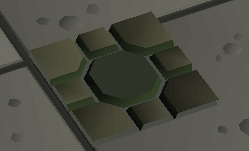
---
#### 21369 (default)
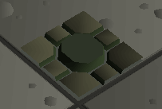
---
#### 21370 (default)
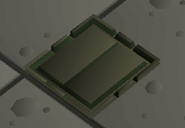
---
#### 40183 (saradomin)
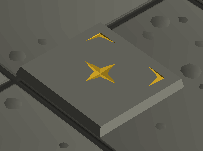
---
#### 40187 (saradomin)
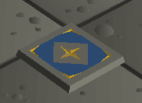
---
#### 40205 (saradomin)
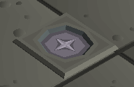
---
### Chests
#### 11204 (chests)
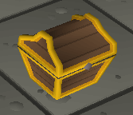
---
#### 11123 (default/chests)
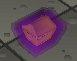
---
#### 12146 (chests)
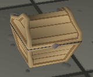
---
#### 12150 (chests)
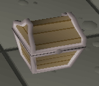
---
#### 12152 (wooden crates)
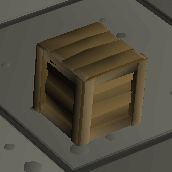
---
#### 12530 (chests)
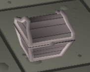
---
#### 15509 (wooden crates)
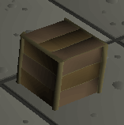
---
#### 15567 (default)
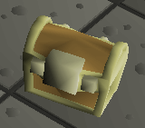
---
#### 15885 (default)

---
#### 29973 (wooden crates)
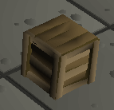
---
#### 31450 (wooden crates)
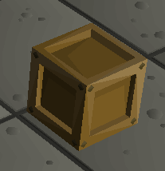
---
#### 33922 (wooden crates)
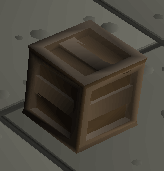
---

## Configurations
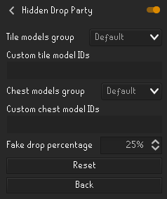

## License
[BSD 2-Clause License](LICENSE)
