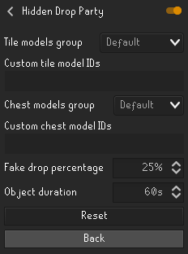

# Hidden Drop Party
RuneLite plugin that hides drops.  Useful for streamers that want to make drop parties on stream but don't want to show where the good drops were placed.

## Version
Current version: **2021.12.1**

*The version format is &quot;&lt;year&gt;.&lt;zero padded month&gt;.&lt;revision number&gt;&quot;.*

## Plugin in action

*Some of the chests have no drops below them.*

## Model IDs
Here are some model IDs that might be useful. See the full list on [OSRSBox](https://www.osrsbox.com/tools/model-search/).
### Tiles (used to obstruct the drop below)
#### 21367

---
#### 21369

---
#### 21370

---
### Chests
#### 11123

---
#### 15567

---
#### 15885

---

## Configurations

## License
[BSD 2-Clause License](LICENSE)
